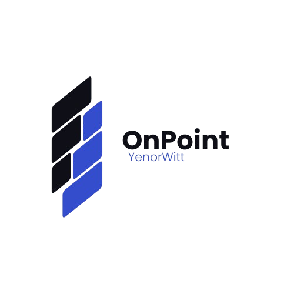
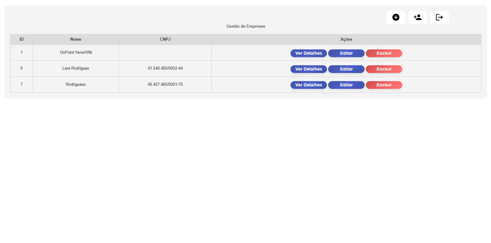
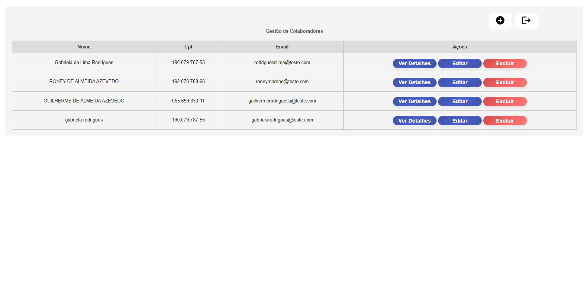
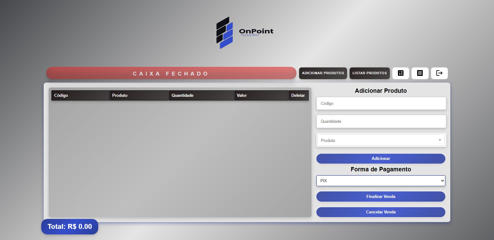
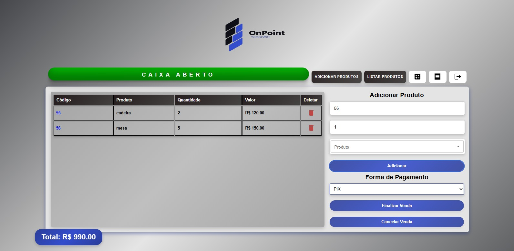
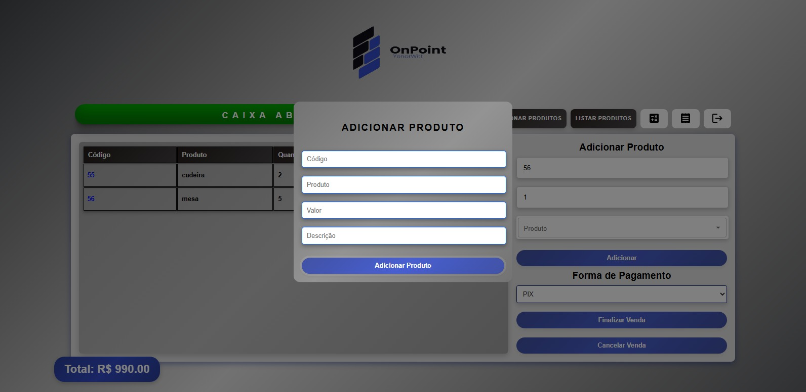
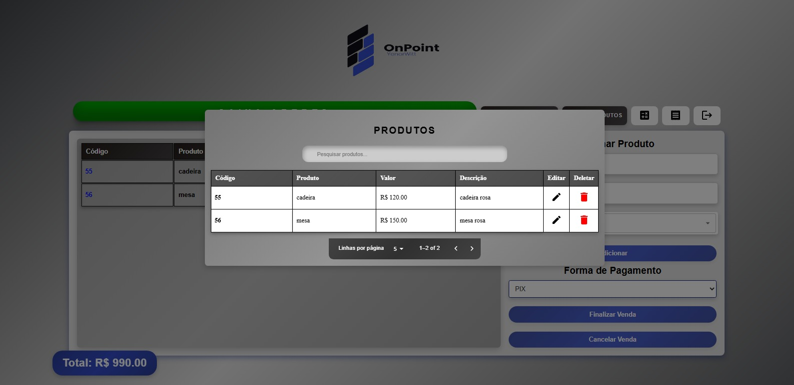
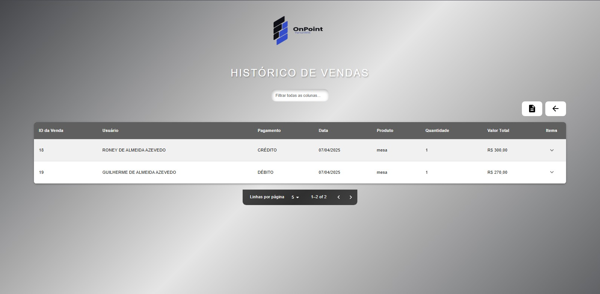
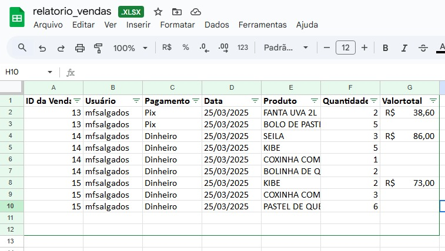

<h1 align="center"> OnPoint YenorWitt </h1>

Um sistema de gestão de negócios robusto utilizando a biblioteca Roles do NestJS para atribuir telas de responsabilidade distintas a cada usuário cadastrado. Defina um usuário administrador de nível 1 com acesso irrestrito a todas as funcionalidades do sistema. Para usuários administradores de níveis diferentes, conceda acesso exclusivo às informações e ferramentas pertinentes à sua respectiva empresa e seus usuários, otimizando a organização de vendas e a distribuição de responsabilidades dentro do seu Ponto de Venda (PDV).o sistema proporciona uma experiência
simples e ágil, facilitando as operações e garantindo mais praticidade para o usuário.

  <a href="#-tecnologias">Tecnologias</a>&nbsp;&nbsp;&nbsp;|&nbsp;&nbsp;&nbsp;
  <a href="#-projeto">Projeto</a>&nbsp;&nbsp;&nbsp;|&nbsp;&nbsp;&nbsp;
  <a href="#-layout">Layout</a>&nbsp;&nbsp;&nbsp;|&nbsp;&nbsp;&nbsp;

 

  

  

  

  

  

  

  

  

  

## 🚀 Tecnologias

Este projeto foi desenvolvido utilizando as seguintes tecnologias, bibliotecas e etc:

- React e CSS
- Nestjs
- Docker
- MySQL
- Typescript
- JavaScript
- Git e Github
- React Router
- React Modal Component (Material UI)

## 💻 Projeto

Ágil e eficiente, o sistema foi desenvolvido para aprimorar a rotina do usuário,
proporcionando uma gestão mais prática e organizada.

---

by RoneyAlmeida :wave:
